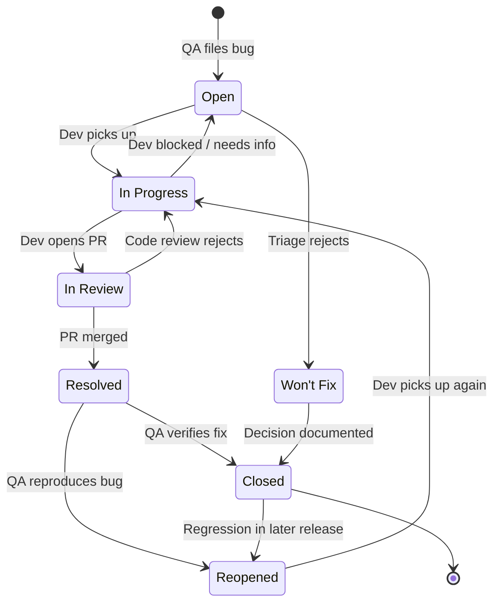

# Bug Lifecycle — Workflow Diagram

GitHub renders Mermaid natively — the diagram below is the actual workflow I configure in the Jira sandbox for this portfolio. Same shape as what most product teams use, with explicit `Won't Fix` and `Reopened` branches that often get omitted in tutorials but matter in production.

## State definitions

| State | Owner | Means |
|---|---|---|
| **Open** | Triage | Reported, validated, ready for engineering to schedule |
| **In Progress** | Dev | Developer actively working — should have an assignee |
| **In Review** | Dev / Reviewer | PR is open, awaiting code review |
| **Resolved** | QA | Code merged, fix deployed to test env, awaiting verification |
| **Closed** | — | QA confirmed the fix; ticket is done |
| **Reopened** | QA | Verification failed OR regression appeared in a later release |
| **Won't Fix** | Triage / PM | Decision made not to fix; reason documented in comment |

## Transition rules (Jira "Conditions" / "Validators")

A workflow without rules is just a flowchart. Two non-trivial rules I always add:

1. **Cannot move `In Review → Resolved` without a linked PR.** Prevents "dev says it's done, QA can't find what changed."
2. **`Closed → Reopened` requires a comment.** Forces the reopener to explain what regressed; saves dev cycles re-investigating from scratch.

## Why explicit `Reopened` rather than back to `Open`?

A bug filed for the first time is different from a bug that already shipped a fix and broke again:

- **`Open`** = new information
- **`Reopened`** = "the fix didn't work" — much higher priority signal

Reports that filter `status = Reopened AND status changed FROM Closed AFTER -90d` are a leading indicator of test-coverage gaps. Lump them under `Open` and you lose that signal.
